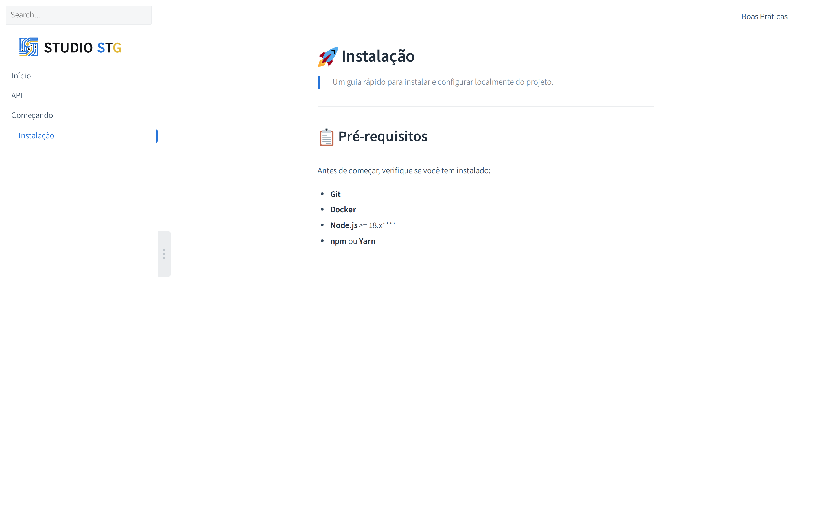
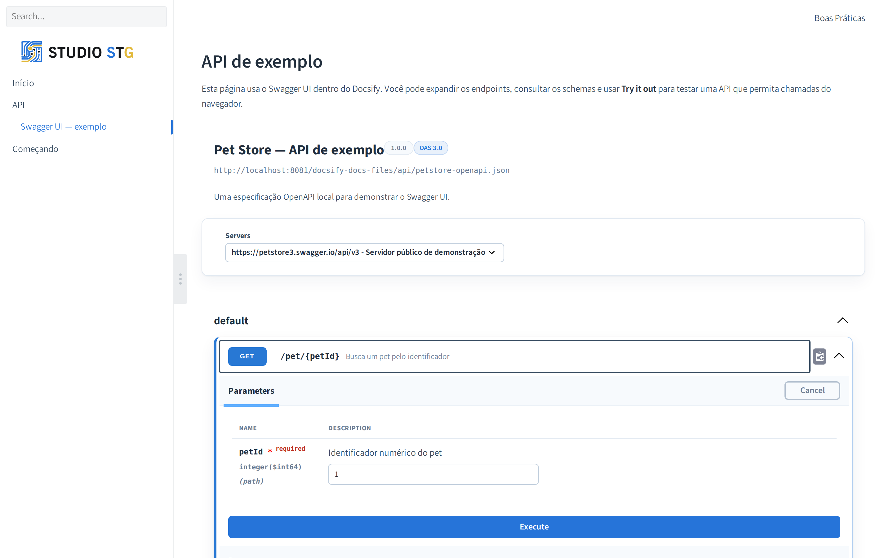
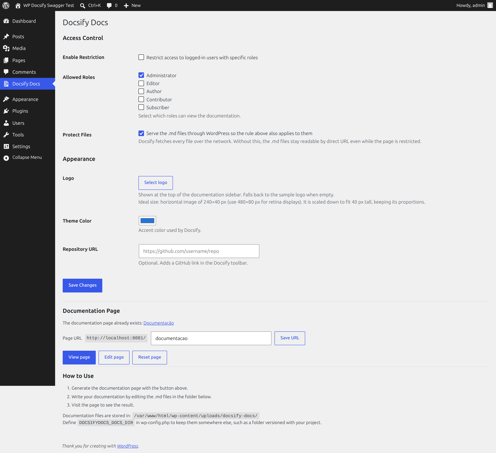

<p align="center">
  <a href="https://docsify.js.org">
    
  </a>
</p>

<p align="center">
  A magical documentation site generator inside wordpress.
</p>

**Docsify Docs** is a WordPress plugin that allows you to create and manage documentation using [Docsify](https://docsify.js.org/), leveraging `.md` files directly within your project. It's ideal for technical projects, user manuals, or any kind of versioned technical documentation.



Markdown pages carrying an OpenAPI specification are rendered as interactive API documentation:



## 📁 Project Structure

```
docsify-docs/
├── docsify-docs.php                  # Plugin header, PSR-4 autoloader, activation hooks
├── config.php                        # Version and the DOCSIFYDOCS_DEFAULT_* constants
├── uninstall.php                     # Removes the options and the deny rule; docs are kept
├── languages/                        # Translation files (pt_BR included)
└── src/
    ├── Access.php                    # Who may read the documentation
    ├── Activator.php                 # Defaults, sample docs, rewrite rules
    ├── Deactivator.php               # Cleans the rewrite rules
    ├── Admin.php                     # Settings page: access control and appearance
    ├── Admin/DocsPage.php            # Create, rename and reset the documentation page
    ├── Core.php                      # Wires every piece on plugins_loaded
    ├── Docs.php                      # Where the .md files live and how they are reached
    ├── FileServer.php                # Serves the files under the access rule
    ├── Hardening.php                 # Deny rule written next to the .md files
    ├── Migration.php                 # Carries data over from the old wp-docsify
    ├── Template.php                  # Registers the template and isolates theme styles
    ├── assets/                       # Plugin styles and scripts
    │   ├── docsify-guide.js          # Step-by-step guide player
    │   ├── guide.css                 # Guide styles
    │   └── vendor/                   # Docsify, Swagger UI, Mermaid and D3 — no CDN
    ├── docs/                         # Sample Markdown copied to the docs folder on activation
    └── templates/                    # docsify-docs.php and access-denied.php
```

## 🧩 Features

- Direct integration of Docsify into WordPress, rendered by a custom page template
- Reads `.md` files from `wp-content/uploads/docsify-docs/`, or from any path you point it at
- Access control that covers the files, not only the page
- Interactive API documentation with Swagger UI, from an OpenAPI file in the docs folder
- Step-by-step guides: a numbered list becomes a walkthrough, one step at a time, with the screenshot of each step
- Docsify plugins included: full-text search, pagination, copy code, collapsible sidebar
- Mermaid diagrams with zoom and pan
- Logo picked from the Media Library, theme color and repository link set from the admin
- Every script and style bundled with the plugin — no external CDN requests
- Simple and database-independent — no Composer required

## 🛠️ Installation

1. Clone this repository or place the plugin in your WordPress plugins directory:

```bash
wp-content/plugins/docsify-docs/
```

2. Activate the plugin through the WordPress admin panel. The sample documentation is copied to `wp-content/uploads/docsify-docs/` on activation.

3. Open **Docsify Docs** in the admin menu and click **Generate documentation page**, or create a page yourself and select the **"Docsify Docs"** template.

## ✍️ How to Use

1. Add your documentation `.md` files inside the directory:

```
wp-content/uploads/docsify-docs/
```

2. `README.md` is the home page, `_sidebar.md` builds the menu and `_navbar.md` the top bar.

3. Adjust the logo, theme color and repository link under **Docsify Docs > Settings** — editing the plugin template is not needed, and changes there are lost on the next update.

## ⚙️ Settings



Everything lives on a single screen under the **Docsify Docs** menu:

| Section | Setting | What it does |
|---|---|---|
| Access Control | Enable Restriction | Limits the documentation to logged-in users |
| Access Control | Allowed Roles | The roles allowed to read it |
| Access Control | Protect Files | Serves the `.md` files through WordPress under the same rule |
| Appearance | Logo | Picked from the Media Library |
| Appearance | Theme Color | Accent color of the documentation and of the API reference |
| Appearance | Repository URL | Adds a GitHub link in the Docsify toolbar |
| Documentation Page | Generate / Page URL / Reset | Creates the page carrying the template, changes its URL, or replaces it |

## 🔒 Access Control

Restriction is set from **Docsify Docs > Settings**: pick the roles allowed to read the documentation, and logged-out visitors are sent to the WordPress login page.

Docsify fetches every `.md` over the network, so restricting the page is not enough on its own — a documentation folder reachable by URL is readable by anyone who guesses the path. **Protect Files**, enabled by default, closes that gap:

- files are served by WordPress through `/docsify-docs-files/…` under the same role rule as the page;
- a deny rule is written next to the files so the folder itself answers nothing;
- only a fixed list of extensions is handed out, and paths that escape the documentation folder are refused.

The endpoint is a rewrite rule, so it needs pretty permalinks. On plain permalinks the setting reports itself as inactive and the files fall back to direct URLs. On nginx, or any server that ignores `.htaccess`, add the equivalent deny for the documentation folder to your server configuration.

## 🪜 Step-by-step Guides

A page whose numbered list is preceded by `<!-- docsify-guide -->` is rendered as a walkthrough — one step at a time, with **Previous** / **Next**, a **Play** button that advances on its own, the arrow keys, and a **See every step** view for reading it in one go. The screenshot of a step opens enlarged on click.

```md
# Create an author

> Dashboard → Users → Add New User

<!-- docsify-guide -->

1. In the sidebar, click **Users**.

   

2. Click **Add New User**.

   
```

The marker is an HTML comment and the steps are an ordinary Markdown list, so the page still reads as a numbered list with images when the script is unavailable, and the search plugin indexes every step. Images follow the same access rule as the rest of the documentation.

## 🧪 API Documentation with Swagger UI

Swagger UI is bundled locally with the plugin. In any Markdown page, add one link named `swagger`; it is replaced by the interactive API documentation:

```md
[swagger](api/openapi.json)
```

The relative path is resolved from the documentation folder and stays behind the same file protection as the Docsify page. JSON, YAML and YML specifications are supported, and an absolute URL can be used when the API hosts its own file.

**Try it out** sends the request from the visitor's browser, so the API has to allow the documentation origin through CORS.

## 📂 Keeping the Docs Under Version Control

Point the plugin at any absolute path with `DOCSIFYDOCS_DOCS_DIR` in `wp-config.php`:

```php
define( 'DOCSIFYDOCS_DOCS_DIR', __DIR__ . '/wp-content/plugins/docsify-docs/src/docs' );
```

With **Protect Files** enabled the folder never has to be reachable by URL, so it can also live outside the web root.

The defaults the plugin starts from can be set the same way, which keeps a project's identity in the repository rather than only in the database:

```php
define( 'DOCSIFYDOCS_DEFAULT_THEME_COLOR', '#004f9f' );
define( 'DOCSIFYDOCS_DEFAULT_ALLOWED_ROLES', [ 'administrator', 'editor' ] );
define( 'DOCSIFYDOCS_DEFAULT_IS_RESTRICTED', true );
define( 'DOCSIFYDOCS_DEFAULT_PROTECT_FILES', true );
```

## 🪝 Filters

| Filter | Purpose |
|---|---|
| `docsify_docs_dir` | Absolute path of the folder holding the `.md` files |
| `docsify_docs_base_path` | URL Docsify prepends to every file it fetches |
| `docsify_docs_isolate_styles` | Return `false` to keep theme and block styles on the page |
| `docsify_docs_kept_styles` | Style handles allowed on the documentation page |

## ✅ Example

```markdown
# Welcome to Docsify Docs

This is the initial documentation.

## Installation

Follow the steps to install and configure the plugin.
```

---

Developed by Jefferson Oliveira using the https://docsify.js.org library 🧑‍💻
